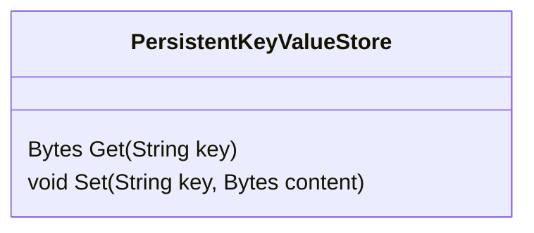

# Protocol

The universal open protocol for implementing other clients.
TBD.

# Clients

## Core
Lang: Go.
Output: Go module
Shared lib for other clients.
Core client provides the main functionality and interfaces. It requires an implementations of a few interfaces from the end-client library for platform specific implemention.

Interfaces:
PersistentKeyValueStore

### Browser 
Lang: Go
Output: WASM, npm module

### PC
Lang: Go
Output: binary

### Mobile
Lang: JS(react native) or Dart(flutter)
Output: 
